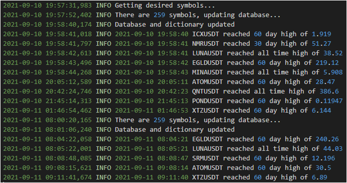

# Binance-Alert-NewHigh

This script notifies the user via Telegram whenever an USDT cryptocurrency pair makes a new 30 day, 60 day or all time high. For each cryptocurrency pair, the notification only happens once a day.

## Description

1. Setup Binance API client and start a websocket API to obtain cryptocurrency market data
2. Filter away unwanted tickers and store remaining ticker symbols into a list
3. Get historical daily candlesticks for these tickers and store into a SQLite database table for each ticker
4. Store the 30 day, 60 day, all time high value into a dictionary
5. Continuously compare current price with the dictionary values and send a Telegram message if greater than
6. Update the list of tickers and database at the start of the next day (UTC +0)

## Demo

This shows the information generated in the log file:

This shows the Telegram messages received when an alert is triggered:

## Technologies Used

- Using python-binance ThreadedWebsocketManager Websocket  
  https://python-binance.readthedocs.io/en/latest/index.html

- Parsing candlestick data  
  https://github.com/binance-us/binance-official-api-docs/blob/master/rest-api.md#klinecandlestick-data
