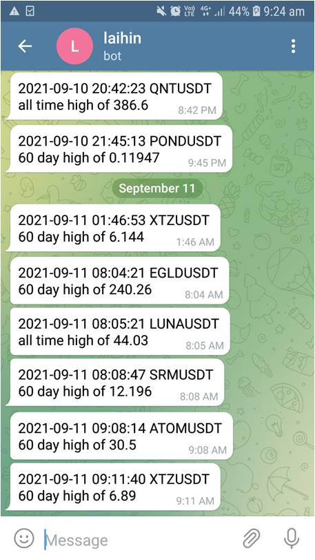

# Binance-Alert-NewHigh

This script notifies the user via Telegram whenever an USDT cryptocurrency pair makes a new 30 day, 60 day or all time high. For each cryptocurrency pair, the notification only happens once a day.

## Description

1. Setup Binance API client and start a websocket API to obtain cryptocurrency market data
2. Filter away unwanted tickers and store remaining ticker symbols into a list
3. Get historical daily candlesticks for these tickers and store into a SQLite database table for each ticker
4. Store the 30 day, 60 day, all time high value into a dictionary
5. Continuously compare current price with the dictionary values and send a Telegram message if exceeded
6. Update the list of tickers and database at the start of the next day (UTC +0)

## Demo

This shows the information generated in the log file:  

This shows the Telegram messages received when an alert is triggered:  

## Technologies Used

- Using python-binance websockets  
  https://python-binance.readthedocs.io/en/latest/index.html

- Parsing candlestick data  
  https://github.com/binance-us/binance-official-api-docs/blob/master/rest-api.md#klinecandlestick-data

- SQLite database for storing candlestick data  
  https://docs.python.org/3/library/sqlite3.html

- Sending Telegram messages  
  https://core.telegram.org/bots#6-botfather

## Setup

1. git clone https://github.com/choilaihin/Binance-Alert-NewHigh.git
2. pip install -r requirements.txt
3. Setup a Binance account and place your Binance API Key and API Secret into a .env file. Refer to https://www.binance.com/en/support/faq/360002502072 for instructions.
4. Setup a Telegram bot and place your bot token and chatID into the .env file. Refer to https://core.telegram.org/bots#6-botfather for instructions.
5. Upon executing python main.py, a logging file 'dailyhigh.log' and database file 'daily_database.db' is created. For the first run, it will take around 10 mins to populate the database with historical candlestick data since 1st Jan 2021.
6. Once the database is populated, the variable first_run can be set to False for subsequent executions of main.py.
